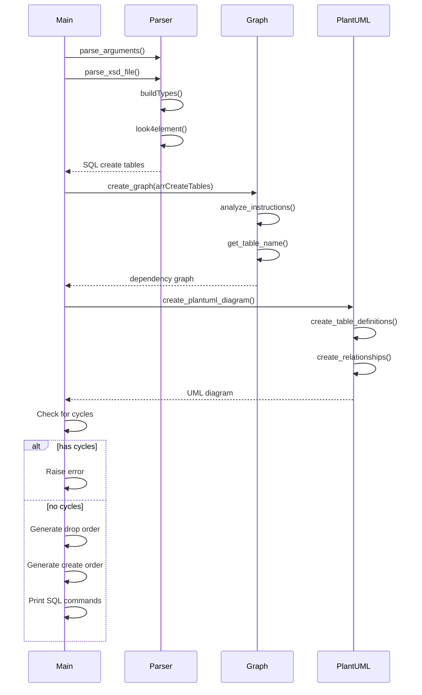

# Code Explanation

## Overview

This document explains the key components and functionality of the script. The Mermaid Diagram below provides a visual representation of the process and the flow of execution.

---

## **Code Explanations**

### 1. **Import and Configuration**
- The script imports necessary modules: `argparse`, `re`, and `networkx`.
- It sets the default database connection settings in the `DB` dictionary.
- Defines the maximum recursion level for processing the XSD file.
- Creates a dictionary `DEFX2P` to map XSD data types to PostgreSQL data types.
- Initializes the `USER_TYPES` dictionary to store user-defined types.
- Defines constants `XMLS` and `XMLS_PREFIX` for working with the XSD namespace.
- Initializes the SQL output variable.
- Defines helper functions and custom exceptions.

---

### 2. **Argument Parser**
- Uses the `argparse` module to handle command-line arguments.
- Defines and parses arguments for:
  - The XSD file.
  - Options such as fail-on-bad-type (`--fail`) and as-is processing (`--as-is`).
  - Database parameters: name, username, password, host, and port.

---

### 3. **XSD Processing**
- Parses the provided XSD file using `lxml.etree`.
- Calls the `buildTypes` function to extract and store user-defined types from the XSD.
- Uses the `look4element` function to recursively process:
  - XSD elements.
  - Sequences and choices.
- The `look4element` function:
  - Generates SQL statements for table creation.
  - Handles foreign key relationships.
  - Normalizes element names (if required).
- Depending on the specified output:
  - Prints SQL statements to stdout.
  - Executes the SQL against the database.

---

### 4. **Helpers**
- **`readable_file`**: Verifies that the provided file is readable and raises an error if not.
- **`pg_normalize`**: Normalizes strings for PostgreSQL by replacing special characters.
- **`look4element`**: Recursively processes XSD elements:
  - Validates types.
  - Maps XSD types to PostgreSQL types.
  - Handles foreign key relationships.
  - Generates SQL for table creation.
- **`GetParentTableName`**: Extracts the parent table name from a string.

---

### 5. **Graph Analysis**
- Creates a directed graph using `networkx` to analyze table dependencies.
- Adds nodes for each table and edges for foreign key relationships.
- Validates the graph to ensure it is acyclic:
  - Reports any detected cycles.
- Performs a topological sort to determine the correct order for table creation and deletion.
- Generates a PlantUML diagram to visualize the database schema:
  - Includes table definitions.
  - Represents relationships between tables.

---

## **Mermaid Diagram**

The Mermaid Diagram above provides a high-level explanation of the process and a comprehensive overview of the script's functionality for the use case not connect with DB. Use Case for connect with DB is simlar; but, the difference is execute script in DB (Database must be exists, previously) instead print in console. It highlights:
- Key components.
- Interactions.
- The flow of execution.

The integrated code explanations clarify the purpose and implementation details of each subgraph and its constituent elements.

---

Feel free to explore the script and the diagram to gain a better understanding of its functionality!

## **More detailed Mermaid Diagram**

```mermaid
flowchart TD
subgraph ImportAndConfiguration
    Start["Start"]
    ImportArgparse["Import argparse"]
    ImportRe["Import re"]
    ImportNetworkx["Import networkx as nx"]
    SetDefaultDBConfig["Set Default DB Connection Settings"]
    SetMaxRecurseLevel["Set MAX_RECURSE_LEVEL"]
    DefineXSD2PGSQLDict["Define DEFX2SQLSERVER Dictionary"]
    DefineUserTypes["Define USER_TYPES"]
    DefineXMLSConstants["Define XMLS and XMLS_PREFIX Constants"]
    DefineOutput["Define SQL Output"]
    DefineHelpers["Define Helpers"]
    End["End"]
    Start --> ImportArgparse --> ImportRe --> ImportNetworkx --> SetDefaultDBConfig --> SetMaxRecurseLevel --> DefineXSD2PGSQLDict --> DefineUserTypes --> DefineXMLSConstants --> DefineOutput --> DefineHelpers --> End
end
subgraph ArgumentParser
    ParseArguments["Parse Arguments"]
    ParseArguments_1["Define and parse command-line arguments"]
    ParseArguments_2["Handle XSD file input"]
    ParseArguments_3["Handle fail on bad type option"]
    ParseArguments_4["Handle as-is option"]
    ParseArguments_5["Handle database name option"]
    ParseArguments_6["Handle database username option"]
    ParseArguments_7["Handle database password option"]
    ParseArguments_8["Handle database host option"]
    ParseArguments_9["Handle database port option"]
    End["End"]
    ParseArguments --> ParseArguments_1 --> ParseArguments_2 --> ParseArguments_3 --> ParseArguments_4 --> ParseArguments_5 --> ParseArguments_6 --> ParseArguments_7 --> ParseArguments_8 --> ParseArguments_9 --> End
end
subgraph XSDProcessing
    Start["Start XSD Processing"]
    ParseXSD["Parse XSD File"]
    ParseXSD_1["Parse XSD file using lxml.etree"]
    BuildTypes["Build Types"]
    BuildTypes_1["Extract defined types from the XSD"]
    BuildTypes_2["Store user-defined types in USER_TYPES"]
    LookForElements["Look for Elements"]
    LookForElements_1["Call look4element function"]
    LookForElements_2["Normalize element names if required"]
    LookForElements_3["Fail on bad XSD types if specified"]
    LookForElements_4["Recursively process elements, sequences, and choices"]
    LookForElements_5["Generate SQL statements for table creation"]
    LookForElements_6["Handle foreign key relationships between tables"]
    HandleOutput["Handle Output"]
    HandleOutput_1["Check if SQL output is specified"]
    HandleOutput_2["Print SQL output to stdout"]
    HandleOutput_3["Connect to the database and execute the SQL"]
    End["End XSD Processing"]
    Start --> ParseXSD --> ParseXSD_1 --> BuildTypes --> BuildTypes_1 --> BuildTypes_2 --> LookForElements --> LookForElements_1 --> LookForElements_2 --> LookForElements_3 --> LookForElements_4 --> LookForElements_5 --> LookForElements_6 --> HandleOutput --> HandleOutput_1 --> HandleOutput_2 --> HandleOutput_3 --> End
end
subgraph Helpers
    Start["Start Helpers"]
    ReadableFile["Readable File"]
    ReadableFile_1["Check if the provided file is readable"]
    ReadableFile_2["Raise ArgumentTypeError if file is not readable"]
    PGNormalize["PG Normalize"]
    PGNormalize_1["Replace special characters in the string"]
    PGNormalize_2["Normalize the string for Postgres"]
    LookForElement["Look for Element"]
    LookForElement_1["Recursively process elements, sequences, and choices"]
    LookForElement_2["Validate XSD types and generate Postgres data types"]
    LookForElement_3["Handle foreign key relationships between tables"]
    LookForElement_4["Generate SQL statements for table creation"]
    GetParentTableName["Get Parent Table Name"]
    GetParentTableName_1["Extract the parent table name from the provided string"]
    End["End Helpers"]
    Start --> ReadableFile --> ReadableFile_1 --> ReadableFile_2 --> PGNormalize --> PGNormalize_1 --> PGNormalize_2 --> LookForElement --> LookForElement_1 --> LookForElement_2 --> LookForElement_3 --> LookForElement_4 --> GetParentTableName --> GetParentTableName_1 --> End
end
subgraph GraphAnalysis
    Start["Start Graph Analysis"]
    CreateGraph["Create Graph"]
    CreateGraph_1["Create a directed graph using NetworkX"]
    CreateGraph_2["Add nodes for each table"]
    CreateGraph_3["Add edges for foreign key relationships"]
    AnalyzeGraph["Analyze Graph"]
    AnalyzeGraph_1["Check if the graph is acyclic"]
    AnalyzeGraph_2["Find and report any cycles in the graph"]
    AnalyzeGraph_3["Perform topological sort to determine the creation order"]
    GeneratePlantumlDiagram["Generate PlantUML Diagram"]
    GeneratePlantumlDiagram_1["Create table definitions in PlantUML format"]
    GeneratePlantumlDiagram_2["Create relationships in PlantUML format"]
    End["End Graph Analysis"]
    Start --> CreateGraph --> CreateGraph_1 --> CreateGraph_2 --> CreateGraph_3 --> AnalyzeGraph --> AnalyzeGraph_1 --> AnalyzeGraph_2 --> AnalyzeGraph_3 --> GeneratePlantumlDiagram --> GeneratePlantumlDiagram_1 --> GeneratePlantumlDiagram_2 --> End
end
ArgumentParser -- "Handles" --> XSDProcessing
XSDProcessing -- "Calls" --> Helpers
XSDProcessing -- "Calls" --> GraphAnalysis

%% Warm color palette with light blue background
classDef default fill:#ffffff,stroke:#333333,stroke-width:2px,color:#333333;
classDef primary fill:#e3f2fd,stroke:#1e88e5,stroke-width:2px,color:#0d47a1;
classDef secondary fill:#fff3e0,stroke:#ff9800,stroke-width:2px,color:#e65100;
classDef accent fill:#e8f5e9,stroke:#43a047,stroke-width:2px,color:#1b5e20;
classDef important fill:#ffebee,stroke:#e53935,stroke-width:2px,color:#b71c1c;
classDef subgraph_main fill:#e1f5fe,stroke:#03a9f4,stroke-width:2px,color:#01579b;
classDef subgraph_fetch fill:#fff3e0,stroke:#ff9800,stroke-width:2px,color:#e65100;
classDef subgraph_parse fill:#e8f5e9,stroke:#43a047,stroke-width:2px,color:#1b5e20;

class Start important;
class ImportArgparse secondary;
class ImportRe accent;
class ImportNetworkx secondary;
class SetDefaultDBConfig primary;
class SetMaxRecurseLevel primary;
class DefineXSD2PGSQLDict secondary;
class DefineUserTypes accent;
class DefineXMLSConstants accent;
class DefineOutput primary;
class DefineHelpers primary;
class End important;
class ParseArguments primary;
class ParseArguments_1 secondary;
class ParseArguments_2 secondary;
class ParseArguments_3 accent;
class ParseArguments_4 secondary;
class ParseArguments_5 primary;
class ParseArguments_6 secondary;
class ParseArguments_7 primary;
class ParseArguments_8 primary;
class ParseArguments_9 primary;
class End important;
class Start important;
class ParseXSD primary;
class ParseXSD_1 primary;
class BuildTypes secondary;
class BuildTypes_1 secondary;
class BuildTypes_2 primary;
class LookForElements secondary;
class LookForElements_1 secondary;
class LookForElements_2 secondary;
class LookForElements_3 secondary;
class LookForElements_4 accent;
class LookForElements_5 primary;
class LookForElements_6 primary;
class HandleOutput secondary;
class HandleOutput_1 accent;
class HandleOutput_2 primary;
class HandleOutput_3 accent;
class End important;
class Start important;
class ReadableFile primary;
class ReadableFile_1 accent;
class ReadableFile_2 secondary;
class PGNormalize primary;
class PGNormalize_1 primary;
class PGNormalize_2 accent;
class LookForElement secondary;
class LookForElement_1 accent;
class LookForElement_2 secondary;
class LookForElement_3 primary;
class LookForElement_4 accent;
class GetParentTableName primary;
class GetParentTableName_1 secondary;
class End important;
class Start important;
class CreateGraph secondary;
class CreateGraph_1 accent;
class CreateGraph_2 secondary;
class CreateGraph_3 primary;
class AnalyzeGraph secondary;
class AnalyzeGraph_1 primary;
class AnalyzeGraph_2 secondary;
class AnalyzeGraph_3 accent;
class GeneratePlantumlDiagram primary;
class GeneratePlantumlDiagram_1 primary;
class GeneratePlantumlDiagram_2 accent;
class End important;
class ImportAndConfiguration subgraph_main;
class ArgumentParser subgraph_parse;
class XSDProcessing subgraph_main;
class Helpers subgraph_main;
class GraphAnalysis subgraph_main;
```

