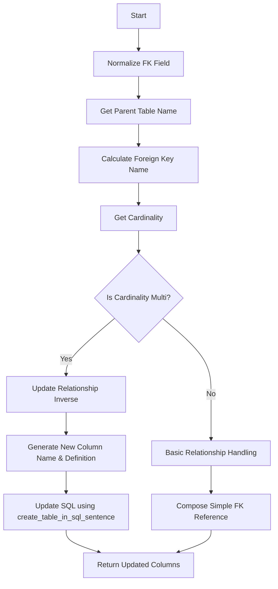

# Function: create_fk_field

This function is responsible for creating foreign key fields as part of SQL table creation or modification. It manages the relationships between tables via foreign keys and updates a dictionary tracking these relationships. It also handles different cardinalities of relationships to ensure consistency of data models.

## Functionality Description

1. **Normalize Foreign Key Field:**
   - Use `pg_normalize` on `field_fk_name` to generate an appropriate foreign key identifier.

2. **Determine Relationships and Cardinality:**
   - Calculate the parent table name and foreign key name.
   - Retrieve the cardinality of the element to determine the type of foreign key relationship.

3. **Check Cardinality Type:**
   - If the cardinality indicates a "many" relationship:
     - Update relationships in `dict_relationships`.
     - Generate column names and definitions accounting for 'many' side specifics.

4. **SQL Statement Update:**
   - Use `create_table_in_sql_sentence` to update the SQL schema of the table, ensuring correct constraint syntax.

5. **Handle Basic Cardinality:**
   - For one-to-one or other simple relationships, compose simpler foreign key references.

6. **Return Updated Columns:**
   - Return the updated columns definition that includes the new foreign key and any necessary constraints.

## Supporting Functions

- **`ends_with_integer`**:  
  Determines if a particular string ends with an integer, aiding in auto-increment policies for foreign key fields.

- **`get_foreign_key_name`**:  
  Constructs a standard foreign key name from a parental and field perspective for consistency.

- **`remove_relationship_dict_relationships` and `add_relationship_dict_relationships`**:  
  Manage the addition and removal of relationships in a centralized relationship dictionary.

- **`cardinality_right_is_n`**:  
  Determines if the right-hand side of a cardinality indicates a 'many' relationship, which influences foreign key handling.

### Key Data Structures

- **`dict_relationships`**: A dictionary that stores table relationships, crucial for both schema generation and understanding database logic as code evolves.