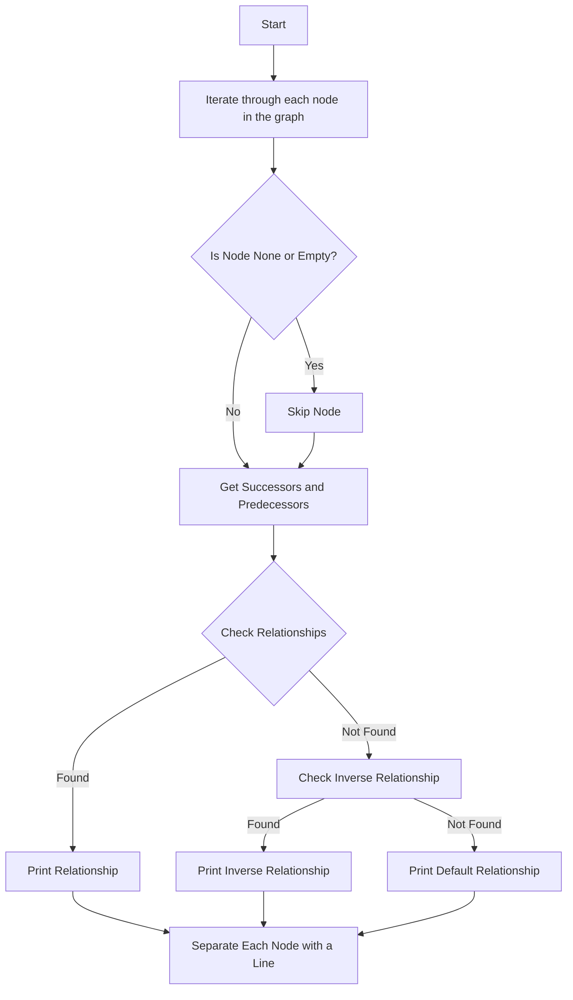

### Explanation of `create_relationships_in_plantuml_diagram`

This function takes two inputs: `graph`, which represents a directed graph, and `dict_relationships`, which is a dictionary of relationships. The purpose of the function is to create and print PlantUML-compatible relationship representations between nodes of the graph according to specified relationships in `dict_relationships`.

#### Steps:
1. **Node Iteration**: Traverse each node in the `graph`.
   - Skip nodes that are `None` or empty.

2. **Get Successors/Predecessors**:
   - Retrieve all nodes that the current node points to (successors).
   - Retrieve all nodes that point to the current node (predecessors).

3. **Relationship Checking**:
   - For each predecessor, check if a relationship exists in `dict_relationships`.
   - If a matching relationship is found, convert cardinalities into PlantUML notation using `translate_cardinality_to_plantuml_notation` and print the relationship between the predecessor and the node.

4. **Inverse Cardinality Handling**:
   - If no direct relationship is found, check for inverse relationships (cases where cardinalities such as `1..*` imply reversed relationships).

5. **Default Relationship**:
   - If neither direct nor inverse relationships are found, default to a generic relationship notation `||--o`.

Below is a representation of the process using Mermaid syntax:

This diagram explains the logic flow of the method, showing how it processes each node, checks for relationships, prints them according to cardinality, and adds a line for separation between nodes. The essential components involve iterating through nodes, looking up relationships, and printing descriptions formatted for PlantUML based on the relationships and cardinalities found.
