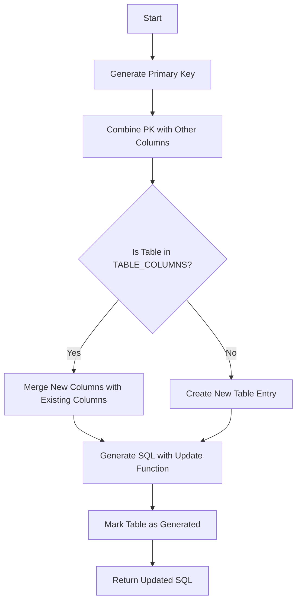

# Function: create_table_in_sql_sentence

This function is designed to create and manage SQL table creation statements, ensuring the appropriate structure for primary and foreign keys, as well as updating existing table definitions if needed.

## Functionality Description

1. **Create Primary Key:**
   - Utilizes `create_primary_key` to generate a normalized primary key for a table.

2. **Concatenate Columns:**
   - Combines the primary key with other specified columns for the table.

3. **Check Existing Columns:**
   - If the table already has defined columns, compare them to the new columns to determine any differences.
   - Update the existing column set if there are new columns to be added.

4. **New Table Creation:**
   - If the table does not exist in `TABLE_COLUMNS`, create a new entry with the specified columns.

5. **Generate SQL Statement:**
   - Use `update_table_creation_in_sql` to form a valid SQL statement for table creation, ensuring the order of primary and foreign keys is maintained.

6. **Mark Table as Generated:**
   - Update internal tracking that the table's SQL definition has been generated.

7. **Return Updated SQL:**
   - Returns the modified SQL with the new table definition.

## Supporting Functions

- **update_table_creation_in_sql**:  
  Adjusts the order of columns ensuring the primary key is first, followed by other columns and foreign keys. Removes existing table definitions in the SQL string using regular expressions and appends the new definition.

- **create_primary_key**:  
  Creates a normalized primary key with a consistent naming scheme and ensures it is of a specific data type (`bigint PRIMARY KEY NOT NULL`).

### Key Data Structures

- **TABLE_COLUMNS**: A global dictionary that keeps track of columns for each table.
- **HASH_TABLE_TABLES_GENERATED**: Tracks which tables have their SQL statements generated to prevent duplication.

This approach encapsulates an efficient management of SQL table definitions from code, facilitating easy updates and maintenance of schema changes directly through Python logic.
