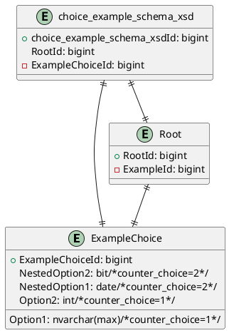

# Handling `xs:choice` and Nested `xs:choice` in SQL Schema Generation

## Overview
This project now correctly handles `xs:choice` elements from XSD schemas and translates them into SQL Server database structures. This ensures that XML choice structures are mapped to relational database tables with proper integrity constraints.

## How `xs:choice` is Processed
- A `xs:choice` is mapped to a **single table** where each possible option is represented as a nullable column.
- A **counter-based comment (`/*counter_choice=X*/`)** is added to indicate the different choice groups.
- If a **nested `xs:choice`** is found, it is **merged into the same table**, ensuring that it does not create redundant structures.

## Example Mapping
For the following XSD:
```xml
<xs:complexType name="ExampleChoice">
  <xs:choice>
    <xs:element name="Option1" type="xs:string"/>
    <xs:element name="Option2" type="xs:int"/>
    <xs:choice>
      <xs:element name="NestedOption1" type="xs:date"/>
      <xs:element name="NestedOption2" type="xs:boolean"/>
    </xs:choice>
  </xs:choice>
</xs:complexType>
```
The resulting SQL schema is:
```sql
CREATE TABLE ExampleChoice (
    ExampleChoiceId bigint PRIMARY KEY NOT NULL, 
    NestedOption2 bit NULL/*counter_choice=2*/, 
    NestedOption1 date NULL/*counter_choice=2*/, 
    Option1 nvarchar(max) NULL/*counter_choice=1*/,
    Option2 int NULL /*counter_choice=1*/
);
```

## Key Points
1. **Single Table for Choices:** The `ExampleChoice` table holds all options, ensuring exclusivity via nullable columns.
2. **Nested Choices are Included:** `NestedOption1` and `NestedOption2` are placed inside the same table, preserving the original XML logic.
3. **Foreign Key Enforcement:** The `Root` table references `ExampleChoice` to maintain hierarchical structure.
4. **PlantUML Representation:** The ERD generated correctly illustrates the relationships.

## Example ERD (PlantUML)


## Conclusion
This implementation ensures that XSD choices are handled properly, maintaining **referential integrity**, **exclusive choice constraints**, and **accurate ERD visualization**.
