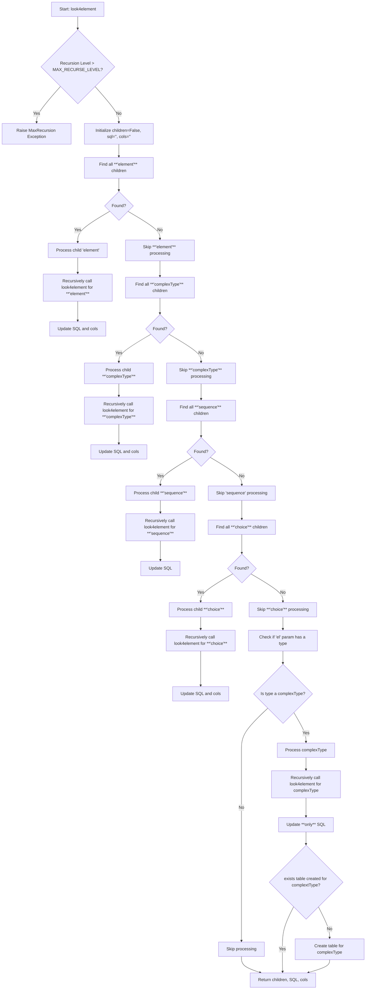

# Function `look4element`

## Function Overview
The `look4element` function is designed to recursively traverse an XML schema and generate corresponding SQL definitions. It identifies various XML components (`<element>`, `<complexType>`, `<sequence>`, and `<choice>`), processes them, and constructs SQL statements. This function also handles nested structures and prevents infinite recursion using a maximum recursion level.

### Key Highlights
1. **Recursion Handling**: The function processes nested XML structures, ensuring no infinite loops occur with a `MAX_RECURSE_LEVEL` check.
2. **SQL Generation**: Generates SQL code for elements and tables dynamically based on XML structure.
3. **Children Detection**: Identifies child elements (`<element>`, `<complexType>`, `<sequence>`, `<choice>`).
4. **Complex Type Processing**: Handles custom-defined complex types by recursively exploring their structure.

---

## Code Breakdown
### Core Components

- **Children Processing**:
    - Loops through specific child types (`<element>`, `<complexType>`, `<sequence>`, `<choice>`).
    - Processes each child recursively using `look4element`.
    - Merges results into the SQL output.

- **Complex Type Handling**:
    - If an element has no children but specifies a `type`, it checks if it's a complex type.
    - Processes the complex type recursively and creates a table if necessary.

- **SQL Updates**:
    - Combines generated SQL with existing SQL statements.
    - Uses helper functions like `concat_cols`, `process_element`, and `create_table_in_sql_sentence`.

---

### Mermaid Diagram
The flowchart below illustrates the function's behavior:



### Auxiliary Functions:
- **`concat_cols`**: Combines already processed columns with new columns, handling different cases.
- **`is_complex_type`**: Checks if a given type is a complex type.
- **`table_was_created`**: Determines if a table has already been created for a given element.
- **`create_table_in_sql_sentence`**: Creates or updates SQL statements for table creation.
- **`process_element`**: Process an XML element in the context of generating columns for a database SQL table. It leverages various helper functions, including `create_fk_field`, to manage foreign keys based on the XML structure and provided metadata.


### Examples:
Process a simple `<element>`:
```python
result = look4element(
    dict_relationships={},
    root=xml_root,
    ns='{http://www.w3.org/2001/XMLSchema}',
    el=xml_element,
    parent='ParentTable'
)
print(result[1])  # Outputs the generated SQL
```

Handle a `<complexType>` with nested elements:
```xml
<xs:complexType name="PersonType">
    <xs:sequence>
        <xs:element name="FirstName" type="xs:string"/>
        <xs:element name="LastName" type="xs:string"/>
    </xs:sequence>
</xs:complexType>
```
