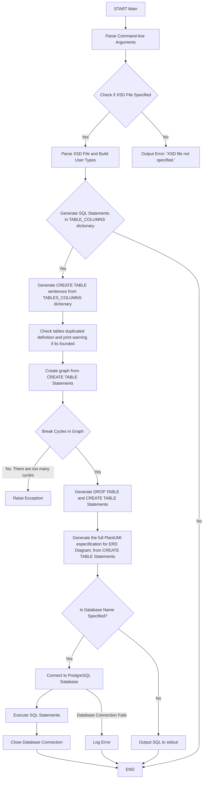

# **"Main Script Execution"**

# Script Specification: XSD to SQL Server

This Python script is designed to create a SQL Server database schema based on an XSD file provided by the user. The script uses the `argparse` library to parse command-line arguments and connects to a SQL Server database using `psycopg2`. 

## Command-Line Arguments

- **XSD File(s)**: Required. One or more XSD files to base the PostgreSQL Schema on.
- **-d, --database**: Name of the database (optional).
- **-u, --user**: Database username (optional).
- **-p, --password**: Database password (optional).
- **-n, --host**: Database host, defaults to 'localhost' (optional).
- **-P, --port**: Database port, defaults to 5432 (optional).
- **-f, --fail**: Fail on bad XSD types, default is False (flag).
- **-a, --as-is**: Do not normalize element names, default is False (flag).

    ## Example:
    * With connection to the Database Server
        * python.exe xsd2sqlschemaerd.py --database PruebaXsd2DBSchema --host "MyServer\MyInstance" --user my_user --password my_password  ".\\Examples\\example.xsd"
    * Without connection to the Database Server
        * python.exe xsd2sqlschemaerd.py ".\\Examples\\example.xsd"

## Main Functionality

1. **Imports Libraries**: Imports necessary libraries such as `argparse`, `psycopg2`, and `lxml.etree`.

2. **Parse Arguments**: Uses `argparse` to parse and handle options.

3. **File Handling and XSD Parsing**:
   - Verifies that an XSD file is specified.
   - Uses `lxml.etree` to parse the XSD file.
   - Constructs a user types dictionary from the XSD file.

4. **SQL Generation**:
   - Generates SQL statements from the XSD schema.
   - Uses regular expressions to prevent duplicated table definitions.
   - Breaks cycles in the graph to generate `CREATE TABLE` and `ALTER TABLE` statements.

5. **Database Connection**:
   - When a database name is specified, connects to the specified PostgreSQL database using `psycopg2`.
   - Executes the generated SQL to create the database schema.

6. **Exception Handling**: Raises an exception if an unexpected state occurs during processing.

## Mermaid Diagram

