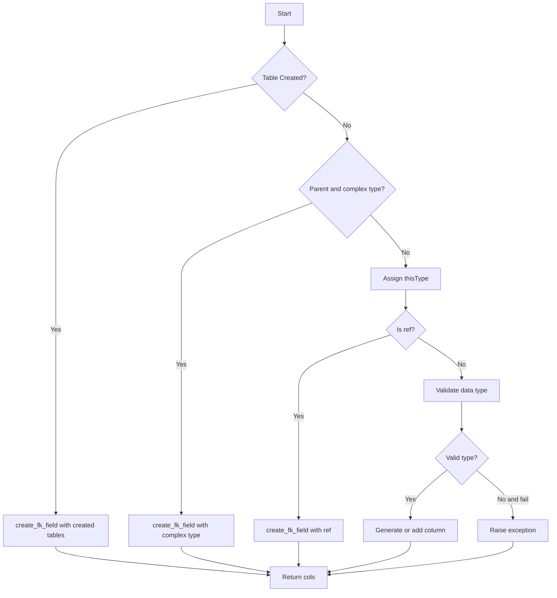

# Documentation for `process_element` Function

The `process_element` function is designed to process an XML element in the context of generating columns for a database SQL table. It leverages various helper functions, including `create_fk_field`, to manage foreign keys based on the XML structure and provided metadata.

## Argument Description

- `el`: The XML element to process.
- `parent`: The parent element in the XML hierarchy.
- `fail`: Boolean indicating whether to raise an exception if an invalid data type is encountered.
- `normalize`: Boolean indicating whether column names should be normalized.
- `counter_choice`: Value greater 0, indicates if the current element originates from a `<choice>` structure. Defaults to 0..
- `cols`: The columns that have already been defined.
- `sql`: Information related to the SQL structure.
- `ns`: The namespace used.
- `root`: The root element of the XML document.
- `dict_relationships`: A dictionary to manage relationships between elements.

## Function Description

1. **Validation of Table Existence**: The function checks if a table has been previously created using `HASH_TABLE_TABLES_GENERATED`. If so, it calls `create_fk_field` for foreign keys and returns the updated columns.

2. **Processing of Complex Types**: If the current element represents a complex type, it calls `create_fk_field` again.

3. **Assignment of `thisType`**: The element's type is retrieved (`el.get('type')`), reference (`el.get('ref')`), or defaults to `'string'`.

4. **Reference Check**: If the element is of reference type, `create_fk_field` is invoked again.

5. **Data Type Validation and Handling**: The function checks the data type against predefined mappings and raises exceptions if invalid (when `fail` is `True`).

6. **Column Generation**: If the data type is valid, it ensures the creation or addition of the corresponding column in the structure.

7. **Additional Processing for Complex Types**: Finally, it handles additional complex types according to the provided context and structure.

## Flowchart

This document and diagram help visualize the logical process and execution paths that `process_element` might follow when processing a given element. The Mermaid flowchart provides a clear and concise way to understand the control structure and decision logic within the function.

